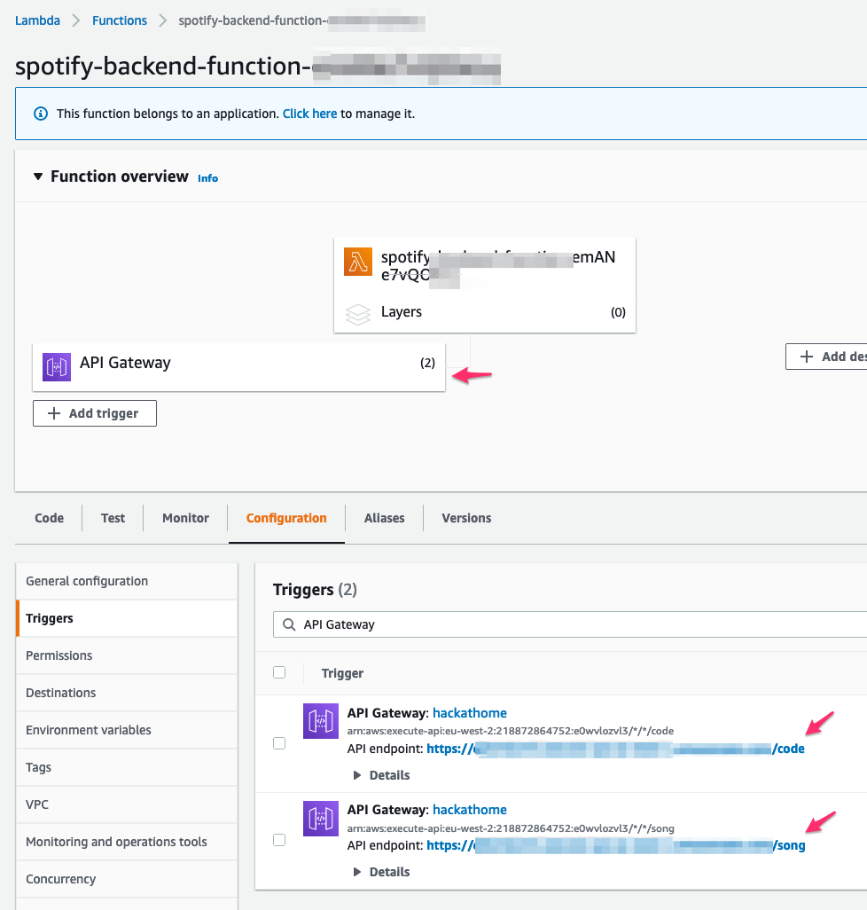

# Spotify backend using AWS Lambda, Dynamo DB & CloudFormation

GET https://xxxx.amazonaws.com/song

```
{
  "artist": "Gojira",
  "track": "The Gift of Guilt"
}
```

The project source includes function code and supporting resources:
- `src/main` - A Java function.
- `src/test` - A unit test and helper classes.
- `template.yml` - An AWS CloudFormation template that creates an application.
- `build.gradle` - A Gradle build file.
- `1-create-bucket.sh`, `2-deploy.sh`, etc. - Shell scripts that use the AWS CLI to deploy and manage the application.

Use the following instructions to deploy the sample application.

# Setup
Download or clone this repository.
Make sure aws if configured to be used through command line.
To create a new bucket for deployment artifacts, run `1-create-bucket.sh`.

    $ ./1-create-bucket.sh
     lambda-artifacts-a5e4xmplb5b22e0d

# Deploy
To deploy the application, run `2-deploy.sh`.

    $ ./2-deploy.sh
    BUILD SUCCESSFUL in 1s
    Successfully packaged artifacts and wrote output template to file out.yml.
    Waiting for changeset to be created..
    Successfully created/updated stack - spotify_backend

This script uses AWS CloudFormation to deploy the Lambda functions and an IAM role. If the AWS CloudFormation stack that contains the resources already exists, the script updates it with any changes to the template or function code.

# Set up AWS Lambda API Gateway
- Setup [AWS CLI](https://docs.aws.amazon.com/cli/latest/userguide/getting-started-install.html) & aws configure.
- Connect API gateway to your lambda [function](https://docs.aws.amazon.com/apigateway/latest/developerguide/getting-started.html).
Create two 2 endpoints: /code and /song

- Create Spotify Application via [dashboard](https://developer.spotify.com/dashboard/applications). Get Client id and Secret.
- Execute 
```GET https://xxxx.amazonaws.com/song?client_id={YOUR_CLIENT_ID}&secret={YOUR_SECRET}```
This will lead you through the OAUTH2 process.
```
{
  "error": "https://accounts.spotify.com/authorize?client_id={YOUR_CLIENT_ID}&response_type=code&scope=user-read-playback-state%20user-modify-playback-state&redirect_uri=https://xxxx.amazonaws.com/code"
}
```
- Follow the URL to authorize the lambda with requested OAuth2 scopes.

# Test
GET https://xxxx.amazonaws.com/song

```
{
  "artist": "Gojira",
  "track": "The Gift of Guilt"
}
```

# Cleanup
To delete the application, run `4-cleanup.sh`.

    $ ./4-cleanup.sh
